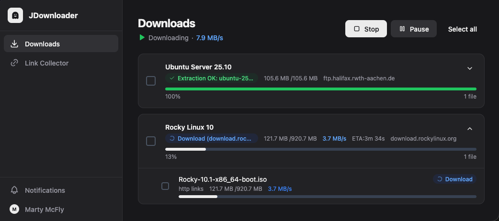

<h1 align="center">
  JDownloader Web
</h1>
<p align="center">
  A self-hosted web interface for <a href="https://jdownloader.org/)">JDownloader</a>
</p>



<p align="center">
  100% Vibe, no code, sorry
</p>
<p align="center">
  Optimized for Web and Mobile, with context-menu and common keyboard shortcuts.
</p>

## Requirements

- **JDownloader** running with the Deprecated API enabled (no MyJDownloader account required)
- **Bun** ≥ 1.1 — [install](https://bun.sh)
- OR **Docker** for containerized deployment

## Docker Quick Start

```bash
docker compose up -d
```

The app will be available at `http://localhost:3001`. On first visit, register your admin account.

Copy and edit the environment variables in `docker-compose.yml` before starting.

## JDownloader Setup

Enable the Remote Control API in JDownloader:

1. Open JDownloader → **Settings** → **Advanced Settings**
2. Search for `DeprecatedApiEnabled` and enable it
3. Disable `DeprecatedApiLocalhostOnly` if the Webinterface runs on a different host than JD
4. Note the port configured in `DeprecatedApiPort` (default: `3128`)

## Stack
This project would not have been possible without the following open-source projects:

- **Frontend** 
  - **[SolidJS](https://www.solidjs.com)**: A declarative JavaScript library for building user interfaces.
  - **[Shadcn Solid](https://shadcn-solid.com/)**: UI components library for SolidJS based on Shadcn designs.
  - **[UnoCSS](https://unocss.dev/)**: An instant on-demand atomic CSS engine.
  - **[Tabler Icons](https://tablericons.com/)**: A set of open-source icons.
- **Backend**
  - **[HonoJS](https://hono.dev/)**: A small, fast, and lightweight web framework for building APIs.
  - **[Drizzle](https://orm.drizzle.team/)**: A simple and lightweight ORM.
  - **[Better Auth](https://better-auth.com/)**: A simple and lightweight authentication library.
  - **[MyJDownloader API for JavaScript (ESM) Client](https://github.com/sevenissimo/jdapi-js)**: A reliable js API base for building modern clients

## Development

```bash
bun install

# Run both servers concurrently
bun run dev

# Or separately
bun run dev:server   # Backend only (port 3001, file-watch enabled)
bun run dev:client   # Vite frontend only (port 5173)
```

All configuration is done via environment variables. Copy `.env.example` to `.env` and adjust:

| Variable | Required | Default | Description |
|---|---|---|---|
| `JDOWNLOADER_HOST` | No | — | IP/hostname of the machine running JDownloader |
| `JDOWNLOADER_PORT` | No | — | Port of the JDownloader Remote Control API (usually `3128`) |
| `BETTER_AUTH_SECRET` | Yes | — | Random secret for session signing — **generate with `openssl rand -hex 32`** |
| `BETTER_AUTH_URL` | Yes | `http://localhost:3001` | Full URL the app is served from (used for cookies/CORS) |
| `PORT` | No | `3001` | Port the backend server listens on |
| `TRUSTED_ORIGINS` | No | — | Comma-separated extra allowed CORS origins (e.g. browser extension URLs) |
| `NODE_ENV` | No | `development` | Set to `production` for production builds |

### Linting

```bash
bun run lint
bun run lint:fix
```

### Project Structure

```
src/
├── server/
│   ├── index.ts              # Server entry, Bun.serve + WebSocket
│   ├── lib/
│   │   ├── broadcaster.ts    # WebSocket broadcaster + JD polling
│   │   ├── jd.ts             # JDownloader API client
│   │   └── auth.ts           # Better Auth config
│   ├── db/                   # SQLite + Drizzle schema
│   └── routes/               # Hono route handlers
└── client/
    ├── pages/                # Downloads, Grabber, Config, Login, Users
    ├── components/           # AppShell, NotificationsPanel, AddLinksDialog, ...
    ├── stores/               # SolidJS signals (ws, auth, jd, notifications, theme)
    ├── lib/                  # API client, type definitions, cache helpers
    └── i18n/                 # translations
```

### Docker

```yaml
# docker-compose.yml
services:
  jd-web:
    build: .
    ports:
      - '3001:3001'
    volumes:
      - jd-data:/app/data
    environment:
      NODE_ENV: production
      PORT: 3001
      BETTER_AUTH_SECRET: # openssl rand -hex 32
      BETTER_AUTH_URL: http://your-server:3001
    restart: unless-stopped

volumes:
  jd-data:
```

### Running the app on an external host (different from the build host)

```yaml
# docker-compose.yml
services:
  app:
    build: .
    image: jd-web:latest
    platform: linux/amd64

```

```bash
docker compose build --no-cache
docker save -o images.tar $(docker compose config --images)
docker load -i images.tar
```

## Extras
There is also a simple Click'N'Load Firefox Addon that comes with this project.

## Disclaimer

This project is not related to [Appwork GmbH](https://wemakeyourappwork.com/) in any form

## License

This project is licensed under the AGPL-3.0 License - see the [LICENSE](./LICENSE) file for details.
