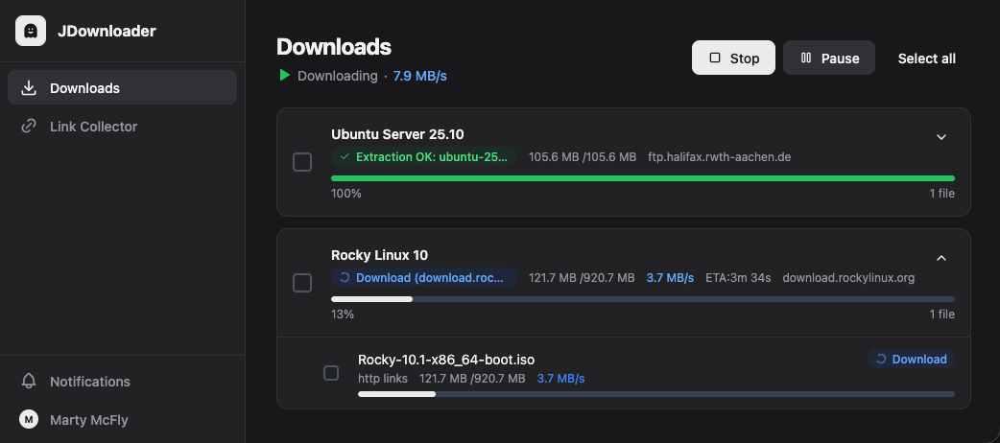

<h1 align="center">
  JDownloader Web
</h1>
<p align="center">
  A self-hosted web interface for <a href="https://jdownloader.org/">JDownloader</a>
</p>



<p align="center">
  100% Vibe, no code, sorry
</p>
<p align="center">
  Optimized for Desktop and Mobile, with context-menu and common keyboard shortcuts.
</p>

## Features
- **Downloads & Link Grabber** - full management: start/stop/pause, priorities, reset, cleanup, per-package/link context menus.
- **Extraction & Download progress** - live progress and ETA.
- **Notifications panel** - surfaces JD dialogs, captchas, and update notifications for JD.
- **Config hub** - manage JD accounts, extensions and all other settings from the UI.
- **Live updates via SSE** - the app subscribes to JDownloader's event bus and streams changes to the browser. No polling, near-instant UI.
- **First-run Setup wizard** - handy dandy wizard that guides you through all the steps you need to take before you can use the app.
- **Click'N'Load Firefox add-on** - see [Extras](#extras).

## Repository Layout

```
.
├── web/              # The web interface (server + client) - see web/
└── addons/
    └── firefox/      # Click'N'Load browser extension
```

## Requirements

- **JDownloader** running with the Deprecated API enabled (no MyJDownloader account required)
- **Bun** ≥ 1.1 - [install](https://bun.sh)
- OR **Docker** for containerized deployment

## Quick Start

```bash
docker run -d --name jdownloader-web -p 3001:3001 -e BETTER_AUTH_SECRET="$(openssl rand -hex 32)" ghcr.io/shippli/jdownloader-web:latest
```

The app will be available at `http://localhost:3001`. On first visit, the **Setup wizard** walks you through creating your admin account and connecting to JDownloader.

Copy and edit the environment variables in `docker-compose.yml` before starting.

## JDownloader Setup

Enable the Remote Control API in JDownloader:

1. Open JDownloader → **Settings** → **Advanced Settings**
2. Search for `DeprecatedApiEnabled` and enable it
3. Disable `DeprecatedApiLocalhostOnly` if the Webinterface runs on a different host than JD
4. Note the port configured in `DeprecatedApiPort` (default: `3128`)

## Stack
This project would not have been possible without the following open-source projects:

- **Frontend** 
  - **[SolidJS](https://www.solidjs.com)**: A declarative JavaScript library for building user interfaces.
  - **[Shadcn Solid](https://shadcn-solid.com/)**: UI components library for SolidJS based on Shadcn designs.
  - **[UnoCSS](https://unocss.dev/)**: An instant on-demand atomic CSS engine.
  - **[Tabler Icons](https://tablericons.com/)**: A set of open-source icons.
- **Backend**
  - **[HonoJS](https://hono.dev/)**: A small, fast, and lightweight web framework for building APIs.
  - **[Drizzle](https://orm.drizzle.team/)**: A simple and lightweight ORM.
  - **[Better Auth](https://better-auth.com/)**: A simple and lightweight authentication library.
  - **[MyJDownloader API for JavaScript (ESM) Client](https://github.com/sevenissimo/jdapi-js)**: A reliable js API base for building modern clients

## Development

All app code lives in `web/`. Run commands from there:

```bash
bun install

# Run both servers concurrently
bun run dev

# Or separately
bun run dev:server   # Backend only (port 3001, file-watch enabled)
bun run dev:client   # Vite frontend only (port 5173)
```

Other scripts:

```bash
bun run build        # Production client build (Vite)
bun start            # Run the server in production mode
bun run db:generate  # Generate Drizzle migrations
bun run db:migrate   # Apply migrations
bun run lint         # ESLint
bun run lint:fix     # ESLint --fix
bun test             # Run tests
```

All configuration is done via environment variables. Copy `.env.example` to `.env` and adjust:

| Variable | Required | Default | Description |
|---|---|---|---|
| `JDOWNLOADER_HOST` | No | - | IP/hostname of the machine running JDownloader |
| `JDOWNLOADER_PORT` | No | - | Port of the JDownloader Remote Control API (usually `3128`) |
| `BETTER_AUTH_SECRET` | Yes | - | Random secret for session signing - **generate with `openssl rand -hex 32`** |
| `BETTER_AUTH_URL` | Yes | `http://localhost:3001` | Full URL the app is served from (used for cookies/CORS) |
| `PORT` | No | `3001` | Port the backend server listens on |
| `TRUSTED_ORIGINS` | No | - | Comma-separated extra allowed CORS origins (e.g. browser extension URLs) |
| `NODE_ENV` | No | `development` | Set to `production` for production builds |

> `JDOWNLOADER_HOST`/`JDOWNLOADER_PORT` can also be set later from within the app.

### Project Structure

```
web/src/
├── server/
│   ├── index.ts              # Server entry, Bun.serve + SSE endpoint
│   ├── lib/
│   │   ├── broadcaster.ts    # SSE broadcaster (event-based patches)
│   │   ├── jdEvents.ts       # JDownloader event-bus listener
│   │   ├── jd.ts             # JDownloader API client
│   │   └── auth.ts           # Better Auth config
│   ├── db/                   # SQLite + Drizzle schema
│   └── routes/               # Hono route handlers (jdownloader, auth, users, setup)
└── client/
    ├── pages/                # Downloads, Grabber, Config, Login, Setup
    │   └── config/           # Accounts, Extensions, Users, Web, Settings, Info
    ├── components/           # AppShell, NotificationsPanel, AddLinksDialog, ContextMenu, ...
    ├── stores/               # SolidJS signals (sse, auth, jd, notifications, theme, ...)
    ├── lib/                  # API client, type definitions, cache helpers
    └── i18n/                 # translations
```

## Docker

```bash
docker compose up -d
```

```yaml
# docker-compose.yml
services:
  jdownloader-web:
    image: ghcr.io/shippli/jdownloader-web:latest
    ports:
      - '3001:3001'
    volumes:
      - jd-data:/app/data
    environment:
      NODE_ENV: production
      PORT: 3001
      BETTER_AUTH_SECRET: # openssl rand -hex 32
      BETTER_AUTH_URL: http://your-server:3001
    restart: unless-stopped

volumes:
  jd-data:
```

## Extras

### Click'N'Load Firefox Add-on

A Firefox extension in [`addons/firefox/`](./addons/firefox) that forwards **Click'N'Load** requests to your JDownloader Web instance.

- Handles encrypted **CNL2** links
- **Offline queue** - captured links are held and retried when the server is reachable
- **Auto-send** or manual review from the toolbar popup

#### Install the Add-on on Firefox for Android
1. ⁝ → Settings → About Firefox
2. Click the Firefox logo until the developer options are enabled
4. Go back one screen. Now you have the ability to install extensions from files.
5. Select the Add-on .xpi and you are done


## Disclaimer

This project is not related to [Appwork GmbH](https://wemakeyourappwork.com/) in any form

## License

This project is licensed under the AGPL-3.0 License - see the [LICENSE](./LICENSE) file for details.
